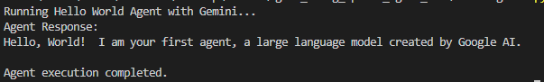

# agent_using_openai_agent_sdk

A simple "Hello World" agent built using the OpenAI Agent SDK.

## Overview

This project demonstrates how to create a basic agent using the OpenAI Agent SDK. The agent responds with a "Hello, World!" message and introduces itself.

## Prerequisites

- Python 3.10 or later
- UV package manager
- OpenAI API key

## Screenshot
